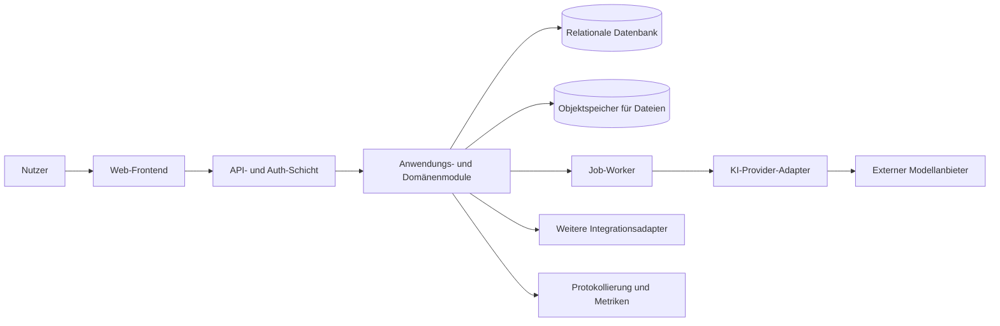

# Architekturentwurf für CyberSarah-21-

**Status:** Entwurf 0.1  
**Rolle:** Technische Grundlage für die erste Implementierungsphase  
**Geltungsbereich:** Webbasierte, KI-gestützte Assistenzanwendung als vorläufige Produktannahme

## 1. Zweck und Annahmen

Da das Repository derzeit keine Produktanforderungen oder Implementierung enthält, dient dieser Entwurf als **hypothesenbasierte Startarchitektur**. CyberSarah-21- wird vorläufig als webbasierte Anwendung verstanden, in der registrierte Nutzer mit einer KI-Assistenz interagieren, Gespräche verwalten, optional Dokumente oder Wissensquellen verwenden und nachvollziehbare Einstellungen sowie Datenschutzkontrollen erhalten.

Diese Annahme ist bewusst reversibel. Die Architektur ist so geschnitten, dass ein anderer Produktfokus später angepasst werden kann, ohne Benutzerverwaltung, Sicherheitsmechanismen, Beobachtbarkeit oder externe Integrationsgrenzen neu erfinden zu müssen. Fachliche Details wie Zielgruppe, Domänensprache, erlaubte Inhalte, Modellanbieter und Aufbewahrungsfristen müssen vor dem produktiven Einsatz bestätigt werden.

## 2. Architekturentscheidung

Für die erste Version wird ein **modularer Monolith** empfohlen. Alle Kernmodule laufen zunächst in einer Anwendung und teilen sich eine Datenbank, bleiben aber durch definierte Schnittstellen, eigene Services und klare Verantwortlichkeiten getrennt. Diese Form minimiert den frühen Betriebsaufwand, ermöglicht schnelle fachliche Iteration und lässt einzelne Teile später gezielt auslagern.

Ein sofortiger Start mit Microservices, eigener Vektordatenbank, Event-Bus und mehreren Deployments wäre für den aktuellen Projektstand nicht gerechtfertigt. Solche Komponenten werden erst eingeführt, wenn Last, Teamgröße, Verfügbarkeitsanforderungen oder Integrationsgrenzen dies tatsächlich erfordern.



## 3. Systemgrenzen

Das System besitzt eine schmale öffentliche Oberfläche und kapselt alle sensiblen Vorgänge serverseitig. Das Frontend darf keine Modellschlüssel, Datenbankzugänge oder privilegierten Integrationszugänge enthalten. Externe KI- und Drittanbieterdienste werden ausschließlich über Adapter angesprochen, damit Anbieterwechsel, Test-Doubles, Kostenkontrolle und Datenschutzprüfungen möglich bleiben.

| Bereich | Zuständigkeit | Nicht enthalten |
|---|---|---|
| Web-Client | Darstellung, Eingaben, Sitzungsstatus und lokale UI-Zustände | Modellaufrufe mit geheimen Schlüsseln |
| API-Schicht | Authentifizierung, Autorisierung, Validierung und Rate Limits | Fachlogik ohne Domänenservice |
| Domäne | Nutzer, Gespräche, Nachrichten, Wissen und Richtlinien | Provider-spezifische SDK-Aufrufe |
| Persistenz | Transaktionen, Abfragen, Indizes und Aufbewahrung | Unkontrollierte Direktzugriffe aus dem Frontend |
| Integrationen | KI, E-Mail, Telemetrie und optionale externe Quellen | Hart verdrahtete Anbieterlogik |
| Hintergrundverarbeitung | Dokumentverarbeitung, Indexierung, Exporte und Wiederholungen | Synchrone Blockierung langer Aufgaben |
| Administration | Moderation, Systemkonfiguration, Audit und Supportwerkzeuge | Uneingeschränkter Zugriff ohne Rollenmodell |

## 4. Kernmodule

### 4.1 Identität und Zugriff

Dieses Modul verwaltet Registrierung oder externes Login, Sitzungen, Rollen, Geräte- und Kontosicherheit sowie den Lösch- und Exportprozess. Es stellt zentrale Autorisierungsprüfungen bereit, die in jedem fachlichen Endpunkt verwendet werden. Rollen sollten mindestens `user`, `moderator` und `admin` unterscheiden; zusätzliche Berechtigungen werden als explizite Policies statt als verstreute Rollenabfragen modelliert.

### 4.2 Nutzerprofil und Einwilligungen

Hier liegen Profil, Sprache, Zeitzone, Präferenzen, Einwilligungsstatus und Benachrichtigungseinstellungen. Einwilligungen werden versioniert gespeichert, damit später nachvollziehbar bleibt, welcher Information ein Nutzer zu welchem Zeitpunkt zugestimmt hat. Sensible Präferenzen werden minimiert und niemals ungeprüft in Modellprompts übernommen.

### 4.3 Gespräche und Nachrichten

Dieses Kernmodul bildet Konversationen, Nachrichten, Anhänge, Status und Titel ab. Es stellt die fachliche Operation „Nachricht senden“ bereit, erzeugt eine unveränderliche Verlaufshistorie und ordnet jede KI-Antwort eindeutig einer Anfrage und einem Modelllauf zu. Änderungen wie Umbenennen oder Archivieren sind von der inhaltlichen Historie getrennt.

### 4.4 KI-Orchestrierung

Der Orchestrator entscheidet, welches Modell und welche Einstellungen für einen zulässigen Anwendungsfall verwendet werden. Er baut den Kontext begrenzt und nachvollziehbar auf, prüft Eingabe- und Ausgabegrenzen, setzt Zeit- und Kostenlimits und speichert technische Metadaten. Die fachliche Domäne kennt nur ein internes Port-Interface wie `generateResponse()`, nicht die API eines konkreten Anbieters.

### 4.5 Wissens- und Dokumentmodul

Dieses Modul ist optional für das MVP und verwaltet Uploads, Dateimetadaten, Extraktion, Berechtigungen und die spätere Suche. Dokumente werden zunächst in einem Objektspeicher abgelegt; die Verarbeitung erfolgt asynchron. Eine semantische Suche oder Vektorisierung wird erst ergänzt, wenn ein konkreter Anwendungsfall und eine Datenschutzbewertung vorliegen.

### 4.6 Richtlinien, Sicherheit und Moderation

Das Modul bündelt Inhaltsregeln, Missbrauchsschutz, Eingabevalidierung, Ausgabekontrollen und Meldeprozesse. Sicherheitsentscheidungen müssen als Ergebnisse mit Gründen und Versionen protokollierbar sein. Die Moderationslogik darf nicht ausschließlich dem externen Modellanbieter überlassen werden, weil die Anwendung eigene Produkt- und Compliance-Regeln benötigt.

### 4.7 Benachrichtigungen und Aufgaben

E-Mail, In-App-Hinweise und lang laufende Vorgänge werden über ein einheitliches Benachrichtigungs- und Job-Interface behandelt. Aufgaben besitzen Status, Wiederholungsstrategie, maximale Versuche und eine Idempotency-ID. Dadurch können Dokumentverarbeitung und spätere Integrationen zuverlässig wiederaufgenommen werden.

### 4.8 Administration und Audit

Administratoren benötigen getrennte Werkzeuge für Nutzerhilfe, Konfiguration, Modellfreigaben, Moderation und Systemzustand. Das Audit-Modul protokolliert sicherheitsrelevante Aktionen wie Rollenänderungen, Exporte, Löschungen, Modellkonfigurationsänderungen und privilegierte Zugriffe. Audit-Einträge dürfen nicht von normalen Nutzern bearbeitet werden.

### 4.9 Beobachtbarkeit und Kostenkontrolle

Technische Logs, Metriken und Traces werden korreliert, ohne Gesprächsinhalte standardmäßig zu loggen. Für jeden Modelllauf werden – soweit verfügbar – Laufzeit, Tokenverbrauch, Modellkennung, Fehlerklasse und Kostenindikator erfasst. Dashboards und Alarme werden auf Verfügbarkeit, Fehlerraten, Latenz, Job-Rückstände und Budgetgrenzen ausgerichtet.

## 5. Vorgeschlagene interne Schichten

Die Anwendung sollte pro Modul eine ähnliche Struktur verwenden: `domain` für Regeln und Typen, `application` für Anwendungsfälle, `ports` für Abstraktionen und `adapters` für Datenbanken, Provider und Transport. HTTP-Handler oder UI-Komponenten dürfen keine SQL-Abfragen und keine direkten Provideraufrufe enthalten.

```text
src/
  modules/
    identity/
    profiles/
    conversations/
    ai-orchestration/
    knowledge/
    safety/
    notifications/
    administration/
    observability/
  shared/
    config/
    errors/
    validation/
    security/
  transport/
    http/
    jobs/
  infrastructure/
    persistence/
    object-storage/
    providers/
```

Diese Struktur ist ein Zielbild und noch keine Entscheidung für ein konkretes Framework. Die Wahl von Sprache, Web-Framework und Hosting soll nach Festlegung der Produktanforderungen erfolgen.

## 6. Zentrales Datenmodell

Das minimale fachliche Modell sollte folgende Entitäten enthalten. Jede Entität erhält eine stabile ID, Erstellungs- und Änderungszeitpunkte sowie – wo erforderlich – einen Lösch- oder Aufbewahrungsstatus.

| Entität | Zweck | Wichtige Beziehungen |
|---|---|---|
| `User` | Identität und Kontostatus | besitzt Profile, Sitzungen und Gespräche |
| `Consent` | Versionierte Einwilligung | gehört zu einem Nutzer |
| `Conversation` | Gesprächscontainer | gehört zu einem Nutzer, enthält Nachrichten |
| `Message` | Nutzer- oder Assistentenbeitrag | gehört zu einem Gespräch |
| `ModelRun` | Nachvollziehbarer KI-Lauf | gehört zu einer Nachricht, verweist auf Modellmetadaten |
| `Attachment` | Datei- oder Medienreferenz | gehört zu Nachricht oder Wissensquelle |
| `KnowledgeSource` | Dokument oder importierte Quelle | gehört zu einem Nutzer oder Arbeitsbereich |
| `Job` | Asynchrone Verarbeitung | referenziert eine fachliche Aufgabe |
| `ModerationDecision` | Regel- und Sicherheitsentscheidung | referenziert Anfrage oder Nachricht |
| `AuditEvent` | Privilegierte oder sicherheitsrelevante Aktion | enthält Akteur, Ziel und Ergebnis |

Gesprächsinhalte und Modellmetadaten sollten getrennt abgefragt und aufbewahrt werden können. Für Such- und Analysezwecke werden keine vollständigen Inhalte in technische Logs kopiert. Löschvorgänge müssen auch abgeleitete Artefakte wie Dateien, Indizes, Caches und Exporte berücksichtigen.

## 7. Beispielhafter Nachrichtenfluss

Beim Senden einer Nachricht authentifiziert die API zuerst die Sitzung, prüft die Berechtigung für das Gespräch und validiert die Eingabe. Danach bewertet das Sicherheitsmodul die Anfrage, lädt nur den erlaubten Gesprächskontext und ruft den KI-Orchestrator über dessen internes Port auf. Die Antwort wird zusammen mit einem `ModelRun` gespeichert, anschließend an den Client zurückgegeben und – ohne vertrauliche Inhalte – beobachtbar gemacht. Lang dauernde Kontext- oder Dokumentverarbeitung wird als Job ausgelagert.

Der gesamte Vorgang muss eine Idempotency-ID akzeptieren. Bei Netzwerkwiederholung darf dadurch keine doppelte Nachricht oder doppelte kostenpflichtige Modellanfrage entstehen. Fehler werden in fachliche und technische Klassen getrennt, damit Nutzer verständliche Rückmeldungen erhalten, während Betreiber die Ursache diagnostizieren können.

## 8. Sicherheits- und Datenschutzgrundsätze

CyberSarah-21- sollte nach dem Prinzip **secure by default** entwickelt werden. Standardmäßig sind Gespräche privat, API-Zugriffe authentifiziert, Rollen minimal berechtigt und externe Datenübertragungen deaktiviert, sofern sie nicht ausdrücklich erforderlich und freigegeben sind. Geheimnisse gehören ausschließlich in die serverseitige Secret-Verwaltung; sie dürfen weder im Repository noch im Frontend erscheinen.

Besonders wichtig sind Eingabevalidierung, Schutz vor Prompt-Injection bei Dokumenten, strikte Mandantentrennung, Rate Limits, CSRF- beziehungsweise Origin-Schutz, sichere Dateityp- und Größenprüfungen, verschlüsselte Übertragung und ein nachvollziehbarer Löschprozess. Für sensible Produktentscheidungen sollte vor der Implementierung eine konkrete Datenschutz- und Bedrohungsmodellierung erfolgen.

## 9. MVP-Reihenfolge

| Stufe | Umfang | Abnahmekriterium |
|---|---|---|
| 0 | Produktanforderungen, Bedrohungsmodell und Technologieentscheidung | Schriftlich bestätigter Scope |
| 1 | Projektgrundgerüst, Konfiguration, Datenbank, Migrationen und CI | Reproduzierbarer lokaler Start |
| 2 | Identität, Nutzerprofil und Autorisierung | Nutzer können sicher angemeldet und getrennt werden |
| 3 | Gespräche und Nachrichten ohne externe KI | Verlauf ist persistent, validiert und testbar |
| 4 | KI-Adapter und Orchestrator | Modellanbieter ist austauschbar und begrenzt |
| 5 | Sicherheitsregeln, Rate Limits und Audit | Kritische Aktionen sind geschützt und nachvollziehbar |
| 6 | Jobs, Benachrichtigungen und optionale Dokumente | Lange Vorgänge blockieren keine Requests |
| 7 | Beobachtbarkeit, Kostenlimits und Deployment | Betrieb ist messbar und kontrollierbar |

## 10. Offene Entscheidungen

Vor dem Beginn der Implementierung müssen Produktziel und Zielgruppe, gewünschte Plattform, Login-Verfahren, Datenregion, Aufbewahrungsdauer, erlaubte KI-Anwendungsfälle, Modellanbieter, Kostenbudget, Dateiformate, Rollenmodell und erwartete Last entschieden werden. Ohne diese Entscheidungen bleibt dieser Text ein Architekturentwurf und darf nicht als produktionsfertige Spezifikation verstanden werden.

## 11. Architekturprinzipien für spätere Reviews

Jede neue Funktion muss einem Modul eindeutig zugeordnet werden können. Externe Systeme werden hinter Ports und Adaptern isoliert. Sicherheits- und Datenschutzentscheidungen werden explizit versioniert. Asynchrone Aufgaben sind idempotent und beobachtbar. Fachliche Tests prüfen Anwendungsfälle unabhängig von Frameworks und Drittanbietern. Ein Wechsel von Anbieter oder Infrastruktur darf keine Änderung der zentralen Domänenregeln erzwingen.
